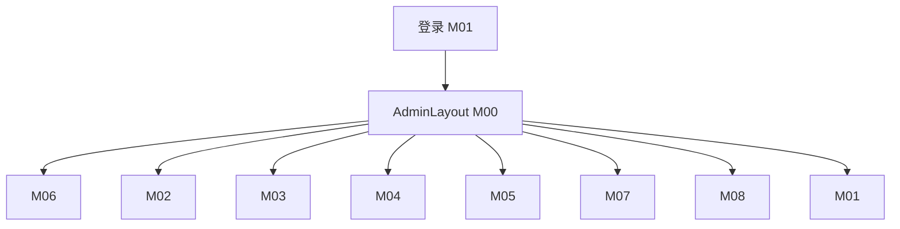

# 00 · 项目概述（共用约定）

| 属性     | 值                              |
| -------- | ------------------------------- |
| 版本     | V1.2                            |
| 状态     | 已定稿                          |
| 适用范围 | `docs/admin/` 下全部 `Mxx` 模块 |

---

## 1. 背景

Trail Memory（印记）是户外印记记录 **C 端移动 Web** 应用。用户注册登录后封存印记，配置 `isPublic` + `linkSuffix`，通过 **`/m/{memoryId}-{linkSuffix}`** 供游客 / NFC 访问。

**为何要后台**：C 端 API 仅操作**当前登录用户**数据（`req.authUser.userId`），运营无法跨用户治理内容、配置印记类型与系统参数。

---

## 2. MVP 目标

1. 独立管理员体系（`AdminUser` + `/api/admin/*`）
2. 全站用户 / 印记查询与风险操作（下架、软删）
3. 印记类型数据库配置（替代硬编码 registry）
4. 运营看板 + 操作审计

---

## 3. 本期不做

审批流、营销推送、多租户计费、重做 C 端 UI、OSS 控制台、管理端编辑印记正文、管理员强制重新上架。

---

## 4. 现有代码基线（开发前必读）

实现后台时**复用**下列能力，勿另起一套错误/鉴权风格。

| 区域       | 路径                                      | 已有能力                                                                                         |
| ---------- | ----------------------------------------- | ------------------------------------------------------------------------------------------------ |
| C 端前端   | `frontend/`                               | Vue 3.5 + Vite 8 + Pinia + `tdesign-mobile-vue`；路由 `/`、`/publish`、`/profile`、`/m/:slug` 等 |
| 管理端前端 | `admin/`（待建）                          | 与 C 端同栈 + **`tdesign-vue-next`**（网页版）；端口 5174                                        |
| API 服务   | `backend/`                                | Express 5 + Prisma + SQLite；`User` / `Memory`                                                   |
| C 端认证   | `backend/src/auth/`                       | register / login / me / patchMe；`authMiddleware`                                                |
| 印记       | `backend/src/memory/`                     | 列表、创建、更新、PATCH 展出、删除、分享 `GET /share/:slug`                                      |
| 上传       | `backend/src/upload/`                     | `POST /api/uploads` → `uploads/` 静态目录                                                        |
| 类型注册表 | `backend/src/imprint-types/registry.ts`   | 4 条硬编码 typeId（M04 将替换）                                                                  |
| 统一错误   | `backend/src/middleware/error-handler.ts` | `AppError`、`ZodError` → `{ success, error }`                                                    |
| 异步路由   | `backend/src/utils/async-handler.ts`      | `asyncHandler` 包裹 controller                                                                   |

**尚未存在**：`admin/` 目录、`backend/src/admin/`、`AdminUser` 等 Prisma 模型。

---

## 5. 目标仓库结构

```
trail-memory/
├── frontend/                 # C 端（已有，端口默认 5173）
├── admin/                    # 管理端（新建，端口建议 5174）
├── backend/                  # API（扩展 admin 路由，端口 3000）
├── docs/admin/               # 本目录
└── package.json              # 增加 dev:admin 等脚本
```

## 5.1 管理端与 C 端技术栈对齐

管理端与 `frontend/` **同一套前端技术选型**，仅 UI 组件库由移动端改为**桌面端**：

| 能力      | C 端 `frontend/`       | 管理端 `admin/`                  |
| --------- | ---------------------- | -------------------------------- |
| 框架      | Vue 3.5                | Vue 3.5（同 major）              |
| 构建      | Vite 8                 | Vite 8                           |
| 语言      | TypeScript ~6          | TypeScript ~6                    |
| 路由      | Vue Router 5           | Vue Router 5                     |
| 状态      | Pinia 3                | Pinia 3                          |
| HTTP      | axios                  | axios                            |
| 工具库    | @vueuse/core           | @vueuse/core（按需）             |
| 图标      | tdesign-icons-vue-next | **同上**（复用）                 |
| UI 组件库 | `tdesign-mobile-vue`   | **`tdesign-vue-next`**（网页版） |
| 包管理    | pnpm                   | **pnpm**（与 C 端一致）          |
| 代码规范  | Prettier + vue-tsc     | 对齐 C 端配置                    |

**不要引入** Ant Design Vue 等其他组件库，避免双设计体系。

### 管理端 `main.ts` 参考

```ts
import TDesign from "tdesign-vue-next";
import "tdesign-vue-next/es/style/index.css";
// 可选：复用 frontend 的 Design Token
// import '../shared-styles/tokens.css' 或复制 frontend/src/styles/tokens.css
```

### 常用组件对照（实现时统一用 TDesign 命名）

| 场景     | 组件                                              |
| -------- | ------------------------------------------------- |
| 后台布局 | `t-layout` + `t-aside` + `t-header` + `t-content` |
| 侧栏菜单 | `t-menu`                                          |
| 表格列表 | `t-table` + `t-pagination`                        |
| 表单     | `t-form` / `t-form-item`                          |
| 抽屉详情 | `t-drawer`                                        |
| 二次确认 | `DialogPlugin.confirm`                            |
| 轻提示   | `MessagePlugin`                                   |
| 日期范围 | `t-date-range-picker`                             |
| 开关     | `t-switch`                                        |
| 图片预览 | `t-image-viewer` 或 `t-image`                     |

---

## 6. 术语

| 术语      | 说明                                                                                      |
| --------- | ----------------------------------------------------------------------------------------- |
| C 端      | `frontend/`，组件库 `tdesign-mobile-vue`                                                  |
| 管理端    | `admin/`，组件库 **`tdesign-vue-next`**（网页版，与 C 端同 Vue/Vite/Pinia 栈）            |
| C 端用户  | `User` 表，JWT 载荷 `userId` + `email`                                                    |
| 管理员    | `AdminUser` 表，JWT 载荷 `adminUserId` + `email` + `role`                                 |
| 印记      | `Memory`，含 `typeId`、`images`（JSON 字符串）、`linkSuffix`                              |
| 分享 slug | 路径参数，格式 `{memoryId}-{linkSuffix}`，解析逻辑见 `memory/service.ts` `parseShareSlug` |
| 软删      | `Memory.deletedAt != null`，C 端与分享接口均不可见                                        |

---

## 7. 角色与权限矩阵

| 权限点                         | SUPER_ADMIN | OPERATOR | VIEWER |
| ------------------------------ | :---------: | :------: | :----: |
| `admin.user.read` / `write`    |    ✓ / ✓    |    —     |   —    |
| `user.read` / `user.write`     |    ✓ / ✓    |  ✓ / ✓   | ✓ / —  |
| `memory.read` / `memory.write` |    ✓ / ✓    |  ✓ / ✓   | ✓ / —  |
| `imprint-type.read` / `write`  |    ✓ / ✓    |  ✓ / ✓   | ✓ / —  |
| `media.read`                   |      ✓      |    ✓     |   ✓    |
| `audit.read`                   |      ✓      |    ✓     |   ✓    |
| `settings.read` / `write`      |    ✓ / ✓    |  ✓ / —   | ✓ / —  |
| `dashboard.read`               |      ✓      |    ✓     |   ✓    |

实现：`requirePermission('memory.write')` 根据 `req.adminAuth.role` 查表。

---

## 8. 全局 API 约定

### 8.1 路由前缀

- 管理端业务：`/api/admin/...`
- C 端公开配置（M04/M08）：`/api/imprint-types`、`/api/settings/public`（非 admin 前缀）

### 8.2 响应格式（与 C 端一致）

成功：

```json
{ "success": true, "data": {} }
```

失败（`AppError`）：

```json
{ "success": false, "error": { "code": "NOT_FOUND", "message": "资源不存在" } }
```

校验失败（Zod）：

```json
{
  "success": false,
  "error": {
    "code": "VALIDATION_ERROR",
    "message": "请求参数校验失败",
    "details": {}
  }
}
```

### 8.3 分页

| 参数       | 默认 | 限制     |
| ---------- | ---- | -------- |
| `page`     | 1    | ≥1       |
| `pageSize` | 20   | 最大 100 |

```json
{
  "success": true,
  "data": {
    "items": [],
    "total": 100,
    "page": 1,
    "pageSize": 20
  }
}
```

### 8.4 鉴权

- Header：`Authorization: Bearer <token>`
- C 端 Token：由 `JWT_SECRET` 签发，**不得**访问 `/api/admin/*`
- 管理端 Token：由 `ADMIN_JWT_SECRET` 签发，载荷见 M01

### 8.5 常用错误码

| code               | HTTP | 场景                             |
| ------------------ | ---- | -------------------------------- |
| `UNAUTHORIZED`     | 401  | 未登录 / Token 无效              |
| `FORBIDDEN`        | 403  | 无权限                           |
| `NOT_FOUND`        | 404  | 资源不存在（含无权限时对外 404） |
| `VALIDATION_ERROR` | 400  | Zod 校验失败                     |
| `CONFLICT`         | 409  | 唯一约束冲突                     |
| `RATE_LIMIT`       | 429  | 登录限流                         |

---

## 9. 管理端 Express 约定

### 9.1 与 C 端隔离的请求字段

```ts
// backend/src/types/express.d.ts 扩展
interface Request {
  authUser?: { userId: string; email: string }; // C 端 authMiddleware
  adminAuth?: { adminUserId: string; email: string; role: AdminRole }; // adminAuthMiddleware
}
```

**禁止**混用：admin 路由只读 `req.adminAuth`。

### 9.2 后端模块模板（与 `auth/`、`memory/` 对齐）

每个管理模块目录：

```
backend/src/admin/<module>/
├── routes.ts       # Router 挂载路径
├── controller.ts   # 解析 req、返回 res.json({ success, data })
├── service.ts      # Prisma + 业务
├── schema.ts       # zod 校验
└── types.ts        # DTO
```

在 `backend/src/admin/index.ts` 聚合：

```ts
adminRouter.use("/users", usersRouter);
```

### 9.3 环境变量（M00 写入 `.env.example`）

| 变量                   | 必填 | 说明                                   |
| ---------------------- | ---- | -------------------------------------- |
| `ADMIN_JWT_SECRET`     | 是   | 与 `JWT_SECRET` 不同                   |
| `ADMIN_JWT_EXPIRES_IN` | 否   | 默认 `8h`                              |
| `ADMIN_CORS_ORIGINS`   | 否   | 默认 `http://localhost:5174`，逗号分隔 |

`loadEnv()` 扩展后，`app.ts` 的 cors `origin` 合并 `CORS_ORIGINS` + `ADMIN_CORS_ORIGINS`。

---

## 10. 管理端前端约定

| 项       | 约定                                                                                                             |
| -------- | ---------------------------------------------------------------------------------------------------------------- |
| 技术栈   | 与 `frontend/` 一致：Vue 3.5 + TS + Vite 8 + Pinia 3 + Vue Router 5 + axios + pnpm                               |
| UI       | **`tdesign-vue-next`** + `tdesign-icons-vue-next`（勿用 `tdesign-mobile-vue`）                                   |
| 工程模板 | 建议复制 `frontend/` 的 `tsconfig` / `vite.config` / Prettier 结构，再替换 UI 依赖与 `main.ts` 引入方式          |
| 目录     | `admin/src/views/<name>/index.vue` + `types.ts` + 可选 `hooks/index.ts`（对齐 C 端 kebab-case 模块思想）         |
| HTTP     | `admin/src/api/http.ts` 独立实例，Token 存 `localStorage` 键名 `trail_admin_token`（与 C 端 `trail_token` 区分） |
| 代理     | 与 C 端相同：`/api`、`/uploads` → `http://localhost:3000`                                                        |
| 默认端口 | `5174`（`strictPort: true`，避免与 C 端 5173 冲突）                                                              |

### 10.1 菜单与路由（全站）

| 路由             | 菜单名   | 模块 | 可见角色       |
| ---------------- | -------- | ---- | -------------- |
| `/login`         | —        | M01  | 公开           |
| `/dashboard`     | 运营看板 | M06  | 全部           |
| `/users`         | 用户管理 | M02  | 全部           |
| `/memories`      | 印记管理 | M03  | 全部           |
| `/imprint-types` | 印记类型 | M04  | 全部           |
| `/media`         | 媒体资源 | M05  | 全部           |
| `/audit-logs`    | 操作审计 | M07  | 全部           |
| `/settings`      | 系统配置 | M08  | 全部；写仅超管 |
| `/admins`        | 管理员   | M01  | 仅 SUPER_ADMIN |

---

## 11. 全局 UI 约定

- 布局：`t-layout` 侧栏宽度 232px（或 240px）+ 顶栏 64px + `t-content` padding 24px
- 列表：筛选区 + `t-table` + `t-pagination`；删除 / 禁用等走 `DialogPlugin.confirm`
- 详情：`t-drawer`，不离开列表页
- 空态 / 加载 / 错误：`t-table` `loading`、表格空态、`MessagePlugin.error` + 重试
- 主题：优先复用 `frontend/src/styles/tokens.css` 品牌色；网页版组件使用 TDesign 默认主题即可

---

## 12. 全局决策（已拍板）

| 项         | 结论                                                   |
| ---------- | ------------------------------------------------------ |
| 管理端目录 | `admin/`                                               |
| 管理员存储 | `AdminUser` 分表                                       |
| 印记删除   | 软删 `deletedAt`                                       |
| 分享下架   | 仅 `isPublic=false`，不改 `linkSuffix`                 |
| 媒体删除   | MVP 不做                                               |
| 数据库     | MVP SQLite                                             |
| 管理端 UI  | `tdesign-vue-next`（与 C 端同技术栈，不用 Ant Design） |

---

## 13. 模块文档标准结构

每份 `Mxx-*.md` 包含：

1. 元信息表（状态、依赖、路由）
2. 模块目标
3. 前置条件
4. 数据模型（Prisma 片段）
5. 接口说明（含请求/响应示例）
6. 管理端页面
7. C 端改动（若有）
8. 文件清单（新增/修改路径）
9. 实现任务清单（checkbox）
10. 验收用例

---

## 14. 信息架构



下一步：[M00-平台基建.md](./M00-平台基建.md)
