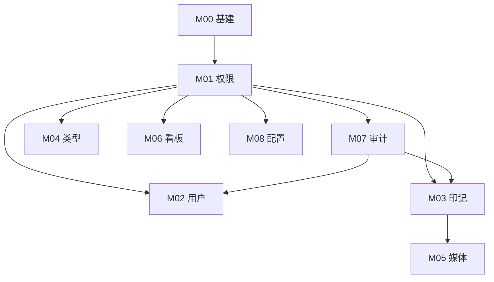

# Trail Memory · 后台管理系统需求文档

> **唯一文档目录**：`docs/admin/`  
> **版本**：V1.2（实现就绪稿）  
> **更新**：2026-05-25 — 管理端前端与 C 端同技术栈，UI 为 `tdesign-vue-next`（网页版）

本目录按**模块**拆分，每份文档可独立指导开发、联调与验收。开发时请先读 [00-项目概述.md](./00-项目概述.md)，再打开对应 `Mxx` 文档。

---

## 如何使用（含 AI 协作）

1. 指定模块：例如「按 `docs/admin/M03-印记管理.md` 实现」。
2. 完成某模块后，将该文档头部 **状态** 改为 `已完成`，并勾选文末任务清单。
3. 有 C 端联动时，必须同时完成文档中的 **C 端改动** 小节，避免后台与 App 行为不一致。

---

## 模块状态

| 模块 | 文档                                         | Sprint | 状态   | 说明                                                    |
| ---- | -------------------------------------------- | ------ | ------ | ------------------------------------------------------- |
| 概述 | [00-项目概述.md](./00-项目概述.md)           | —      | 已定稿 | 全局约定                                                |
| M00  | [M00-平台基建.md](./M00-平台基建.md)         | 1      | 已完成 | 必先完成                                                |
| M01  | [M01-管理员与权限.md](./M01-管理员与权限.md) | 1      | 已完成 | 阻塞全部业务模块                                        |
| M02  | [M02-用户管理.md](./M02-用户管理.md)         | 2      | 已完成 | 写操作需 M07 审计函数                                   |
| M03  | [M03-印记管理.md](./M03-印记管理.md)         | 2      | 已完成 | 含 C 端软删过滤                                         |
| M04  | [M04-印记类型配置.md](./M04-印记类型配置.md) | 3      | 已完成 | 含 C 端动态类型                                         |
| M07  | [M07-操作审计.md](./M07-操作审计.md)         | 3      | 待开发 | 可与 M02/M03 并行，但写接口接入前须完成 `writeAuditLog` |
| M06  | [M06-运营看板.md](./M06-运营看板.md)         | 4      | 待开发 | 只读聚合                                                |
| M05  | [M05-媒体资源.md](./M05-媒体资源.md)         | 4      | 待开发 | 只读扫描                                                |
| M08  | [M08-系统配置.md](./M08-系统配置.md)         | 4      | 待开发 | 含可选 C 端分享域名                                     |

---

## 推荐实施顺序

```
00 阅读约定
 → M00 基建（含 audit 空实现、admin 工程）
 → M01 管理员登录 + RBAC
 → M07 审计表与 writeAuditLog（建议早于 M02/M03 写接口联调）
 → M02 用户管理 ∥ M03 印记管理
 → M04 印记类型
 → M06 看板 ∥ M05 媒体 ∥ M08 配置
```



---

## 文档列表（快速跳转）

| 文档                                      | 一句话                                        |
| ----------------------------------------- | --------------------------------------------- |
| [00-项目概述](./00-项目概述.md)           | 术语、权限矩阵、API/UI/后端模板、现有代码基线 |
| [M00-平台基建](./M00-平台基建.md)         | `admin/` 工程 + `/api/admin` 挂载             |
| [M01-管理员与权限](./M01-管理员与权限.md) | AdminUser、JWT、登录、RBAC                    |
| [M02-用户管理](./M02-用户管理.md)         | 全站用户查询、禁用、验证                      |
| [M03-印记管理](./M03-印记管理.md)         | 全站印记、下架、软删                          |
| [M04-印记类型配置](./M04-印记类型配置.md) | 类型 DB 化                                    |
| [M05-媒体资源](./M05-媒体资源.md)         | 上传目录浏览                                  |
| [M06-运营看板](./M06-运营看板.md)         | 指标与趋势                                    |
| [M07-操作审计](./M07-操作审计.md)         | 审计日志                                      |
| [M08-系统配置](./M08-系统配置.md)         | 分享域名、邮箱验证开关                        |

---

## 与 C 端文档

| C 端                                     | 后台模块 |
| ---------------------------------------- | -------- |
| [登录模块.md](../../登录模块.md)         | M02、M08 |
| [印记列表模块.md](../../印记列表模块.md) | M03      |
